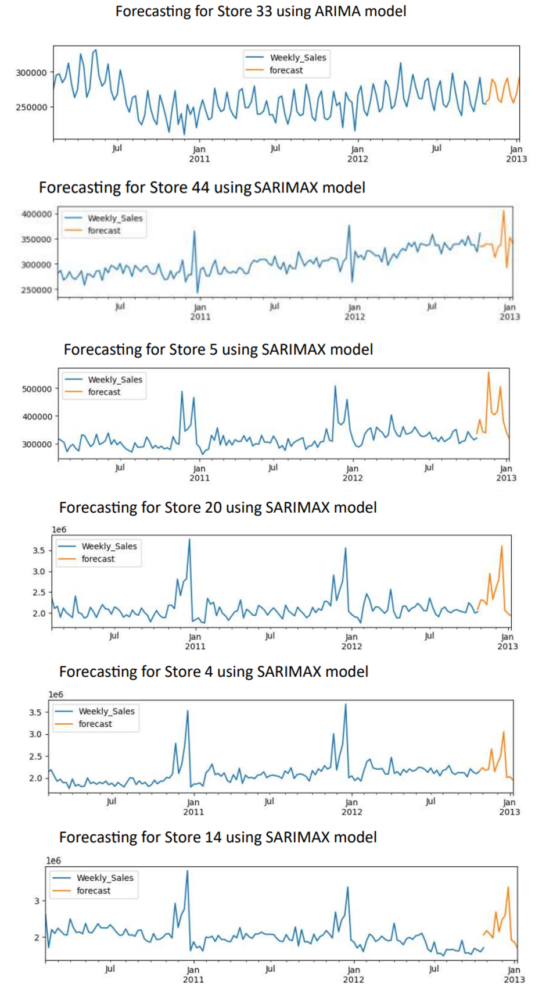

# Retail Sales Forecasting with SARIMAX

## Overview

This project leverages SARIMAX time series forecasting to predict retail sales for the next 12 weeks. The dataset (`walmart.csv`) includes essential features such as store number, date, weekly sales, holiday flag, temperature, fuel price, CPI, and unemployment rate.

## Dataset Details

### Columns:
- **Store:** Store number
- **Date:** Week of Sales
- **Weekly_Sales:** Sales for the given store in that week
- **Holiday_Flag:** If it is a holiday (1) or not (0)
- **Temperature:** Temperature on the day of sale
- **Fuel_Price:** Cost of fuel in the region
- **CPI:** Consumer Price Index
- **Unemployment:** Unemployment rate

### Preprocessing Steps:
1. Load Data
2. Exploratory Data Analysis
3. Model Predictions (SARIMAX)
4. Forecast
5. Compare Results with ARIMA

## Model Comparison and Parameters

- **Model:** SARIMAX
- **Comparison:** ARIMA
- **AutoARIMA:** Utilized for automated parameter tuning

## Evaluation Metrics

- **Mean Absolute Error (MAE)**
- **Mean Absolute Percentage Error (MAPE)**
- **Root Mean Squared Error (RMSE)**

## Screenshots

1. **Plot of Weekly Sales against Time for Selected Stores**
   - 

2. **Plot Showing Effect of Different Features on Weekly Sales**
   - 

3. **Evaluation Scores of ARIMA Model for 6 Stores**
   - 

4. **Evaluation Scores of SARIMAX Model for 6 Stores**
   - 

5. **Predictions of SARIMAX Model for Top 3 Stores**
   - 

6. **Predictions of SARIMAX Model for Bottom 3 Stores**
   - 

7. **Forecasting of All 6 Stores using SARIMAX**
   - 

## License

This project is licensed under the [MIT License](LICENSE).

## How to Use

1. Clone the repository.
2. Ensure you have the necessary dependencies installed (`pandas`, `statsmodels`, etc.).
3. Run the SARIMAX forecasting script.

Feel free to explore and contribute to enhancing forecasting accuracy!

